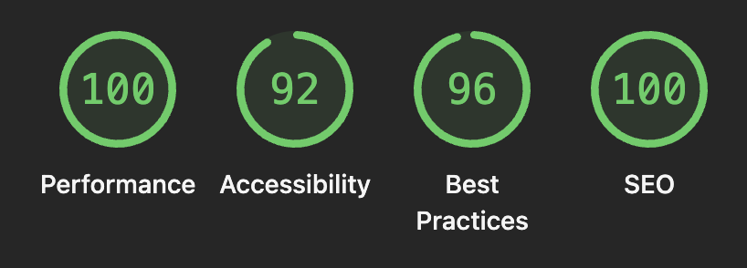

# 학습 플래너 (fe-study-planner)

채용 과제 FE-B. 주간 학습 스케줄을 시각적으로 편집·저장하는 플래너입니다.



Lighthouse 측정 (`/?weekStart=YYYY-MM-DD` 페이지, 데스크톱 기준).

---

## 목차

1. [기술 스택](#1-기술-스택)
2. [실행 방법](#2-실행-방법)
3. [프로젝트 구조](#3-프로젝트-구조)
4. [요구사항 해석 및 가정](#4-요구사항-해석-및-가정)
5. [설계 결정과 이유](#5-설계-결정과-이유)
6. [미구현 / 제약사항](#6-미구현--제약사항)
7. [AI 활용 범위](#7-ai-활용-범위)

---

## 1. 기술 스택


| 영역       | 선택                                              |
| -------- | ----------------------------------------------- |
| 프레임워크    | Next.js 16 (App Router) + React 19 + TypeScript |
| 서버 상태    | TanStack Query v5                               |
| 편집 상태    | Zustand                                         |
| API 검증   | Zod                                             |
| Mock API | MSW                                             |
| 스타일링     | CSS Module + CSS 변수                             |
| 테스트      | Vitest + Testing Library                        |
| 패키지 매니저  | npm                                             |


스타일링에 Tailwind를 쓰지 않은 이유는 5.1에 적어뒀습니다.

---

## 2. 실행 방법

```bash
npm install
npm run dev
# http://localhost:3000
```

```bash
npm run lint        # ESLint
npm run test        # Vitest watch
npm run test:run    # Vitest 1회
npm run build       # 프로덕션 빌드
npx tsc --noEmit    # 타입 체크
```

Mock API(MSW)는 dev/test에서 자동 활성. 별도 백엔드는 필요하지 않습니다. Node 20+가 필요합니다 (Next.js 16 요구).

---

## 3. 프로젝트 구조

```
src/
├── app/                    # Next.js App Router 진입점
├── components/
│   ├── planner/
│   │   ├── grid/           # WeekGrid (요일×시간 그리드, 현재 시각 라인)
│   │   ├── editor/         # BlockEditor 모달 + TimePicker
│   │   ├── summary/        # WeeklySummary
│   │   ├── controls/       # WeekNav, DayTabs, SaveBar
│   │   └── PlannerView.tsx
│   └── ui/                 # Modal, Combobox, Toast (직접 구현)
├── hooks/                  # useCourses, usePlanner, useSavePlanner, useBeforeUnload
├── stores/plannerStore.ts  # Zustand — 편집 상태 + dirty 추적
├── lib/                    # 순수 도메인 로직
│   ├── time.ts             # 시간 변환·비교
│   ├── conflict.ts         # 충돌 판정
│   └── summary.ts          # 요약 집계
├── api/                    # API 클라이언트 + ApiError
├── mocks/                  # MSW handlers + 인메모리 스토어
├── types/                  # Course, StudyBlock, TimeString 공용 타입
└── styles/                 # tokens.css + globals.css
```

`lib/`는 UI/네트워크 의존이 없는 순수 함수, `stores/`는 편집 상태만, `hooks/use*`는 TanStack Query wrapper로 서버 상태만 다룹니다.

컴포넌트에서 시간을 직접 계산하지 않고 항상 `lib/`을 호출합니다. 두 상태가 섞이지 않게 두는 게 이 구조의 목적입니다.

---

## 4. 요구사항 해석 및 가정

명세에 없는 부분은 다음과 같이 가정했습니다. 각 사유는 5번에 적었습니다.

- 시간 충돌은 반열림 구간 `[start, end)`로 봅니다. 09:00–10:00과 10:00–11:00은 인접일 뿐 충돌이 아닙니다.
- 시간 입력 단위는 30분으로 잠갔습니다. 그리드도 30분이라 입력·그리드·충돌 검사 단위를 일치시켰습니다. ([5.11](#511-시간요일-입력-ui))
- 시간 범위는 08:00~20:00 고정입니다. 자정을 넘는 블록(day-crossing)은 지원하지 않습니다.
- 요약은 그리드 상단에 두고 편집 중에도 즉시 갱신됩니다.
- 모바일은 640px 미만에서 일별 탭 뷰로 전환합니다.
- 저장 피드백은 토스트(순간 알림) + SaveBar(현재 상태) 조합입니다. 충돌이 1개 이상이거나 저장 중이면 저장 버튼을 잠급니다.
- 이탈 보호는 두 경로로 나눠 막습니다. 브라우저 이탈은 `beforeunload`, 앱 내 라우팅은 `window.confirm`.

---

## 5. 설계 결정과 이유

> 그동안 AI와 설계하면서 결정한 문서들의 내용을 토대로 가져온 것입니다.

### 5.1 기술 스택 — Tailwind를 쓰지 않은 이유

이 과제의 핵심은 동적 그리드 좌표 계산입니다. 블록의 `top`/`height`는 `startTime`/`endTime`에서 픽셀 단위로 계산되어 inline style로 들어가요. 이 영역에선 Tailwind의 utility-first 강점이 살지 않습니다.

CSS Module이 더 맞다고 본 이유는 세 가지입니다.

첫째, `.block.conflict`나 `.block.editing` 같은 상태별 분기가 `cn()`으로 길게 묶는 것보다 의도가 잘 드러납니다. 둘째, `grid-template-columns: 60px repeat(7, 1fr)` 같은 표현이 임의값 클래스(`grid-cols-[60px_repeat(7,1fr)]`)보다 읽기 좋습니다. 셋째, 색·간격·타이포를 `tokens.css`의 CSS 변수로 일원화하면 변경 비용이 한곳에 모입니다.

화려한 인터랙션 대신 단정함과 가독성을 우선했습니다.

+) 추가로 CSS Module에 자신이 있기도 했습니다

### 5.2 상태 분리 — 서버 상태 vs 편집 상태

서버에서 받은 블록은 TanStack Query 캐시(`usePlanner`)에 두고, 편집 중인 블록은 Zustand 스토어(`plannerStore`)에 둡니다. 전자는 "사실", 후자는 "작업본"이고, 둘이 절대 섞이지 않게 하는 게 원칙입니다.

dirty 판정은 `blocks`와 `original` 스냅샷을 정규화 비교합니다 (id·요일·시간·메모, 순서 무시). 플래그 방식의 "되돌렸는데도 dirty"인 문제를 피하기 위함입니다.

```
┌──────────────┐  ① fetch       ┌──────────────────┐
│ TanStack     │ ───────────►   │ plannerStore     │
│ Query Cache  │  (hydrate)     │   blocks         │ ◄── 편집
│ (서버 진실)  │                │   original (snapshot)
└──────────────┘                └──────────────────┘
       ▲                                │
       │ ④ setQueryData                 │ ② 저장
       │                                ▼
       │                        ┌──────────────────┐
       └────────────────────────┤ saveMutation     │
            ③ 성공: hydrate     │  (POST /planner) │
            실패: 편집 그대로   └──────────────────┘
```

저장이 성공하면 서버 응답으로 `hydrate(serverBlocks)`를 다시 호출합니다. `blocks = original`이 되어 dirty가 자연스럽게 false가 되고, 신규 블록에는 서버가 부여한 `id`가 반영됩니다. 실패하면 편집 상태를 손대지 않고 사용자가 그대로 재시도할 수 있습니다. 자동 refetch도 dirty 상태면 hydrate를 무시해서 사용자 편집을 덮어쓰지 않습니다.

메모리는 두 배(blocks + original)지만 한 주 블록은 많아야 수십 개라 비용은 무시할 수 있습니다.

### 5.3 시간 충돌 판정 — 반열림 구간

`[start, end)` 기준입니다. 끝 시각과 다음 시작 시각이 같은 인접 블록은 충돌이 아닙니다.

```
09:00 ─────── 10:00 ─────── 11:00
   블록 A          블록 B          → 충돌 아님

충돌식: aStart < bEnd && bStart < aEnd
```

"9시까지" 끝나면 10시부터 다른 일정이 가능한 게 직관에 맞고, Google/Apple Calendar도 같은 규칙입니다. 명세에 정의가 없어서 보수적 판정보다 사용성을 우선했습니다. 추가로 빈 슬롯 클릭 시 직전 블록 종료 시각이 새 블록 시작 시각으로 채워지는 흐름이라 이 흐름이 차단되면 안 됩니다.

판정 함수는 `lib/conflict.ts`에 단일 출처로 두고 모달과 SaveBar 모두 같은 함수를 씁니다.

### 5.4 그리드 렌더링 — CSS Grid + absolute 좌표

CSS Grid로 7개 컬럼만 잡고, 각 컬럼 안에서는 absolute로 카드/라인을 자유 배치합니다. 카드 위치는 `top = (start - dayStart) * pxPerMinute`, `height = duration * pxPerMinute`으로 계산합니다. 가로선은 정시마다 한 줄 그리고, 첫 시각(08:00) 위쪽엔 그리지 않습니다. table 형식 셀은 만들지 않았습니다.

셀 단위 grid-row span 방식을 안 쓴 이유는 세 가지입니다. 09:00–10:30 같은 1.5시간 블록은 셀 단위로 안 맞고, 같은 시간대에 두 카드가 겹칠 때 grid-row span은 한쪽이 밀려 사라지는데 absolute는 z-index와 outline으로 자연스럽게 충돌을 표현할 수 있습니다. 현재 시각 라인 같은 동적 요소도 같은 좌표계로 계산할 수 있고요.

트레이드오프로 `pxPerMinute` 상수(WeekGrid의 `SLOT_HEIGHT_PX`)와 `--grid-slot-height` CSS 변수를 두 군데 동기화해야 합니다. 주석에 명시해뒀습니다.

현재 시각 라인은 primary-600 색 2px 가로선에 좌측 dot과 우측 시각 배지를 붙였습니다. 배지는 일요일 컬럼 바깥(body padding-right)에 두어 카드와 안 겹칩니다. 1분마다 `setInterval`로 갱신하고, SSR mismatch를 막기 위해 마운트 전엔 null을 반환합니다. 이번 주가 아니면 라인을 숨깁니다. 다른 주 화면에 빨간 라인이 떠 있으면 혼란스럽기 때문입니다.

### 5.5 요약 위치 — 그리드 상단

요약은 클라이언트에서 집계합니다. `lib/summary.ts`의 `summarizeWeek(blocks, courses)` 순수 함수가 `{ totalMinutes, byCourse, byDay }`를 반환합니다.

이미 클라가 들고 있는 데이터로 충분해서 별도 요약 API는 라운드트립만 늘립니다. 편집 중에도 즉시 반영되어야 하는데 서버 집계는 저장 전엔 못 보여주고요. 순수 함수라 테스트도 쌉니다.

위치는 그리드 위에 둡니다. 페이지 진입 시 가장 먼저 보이는 정보가 "이번 주 학습 총량 + 강의별 분포"인 게 그리드보다 정보 위계가 위라고 봤습니다.

알 수 없는 `courseId`나 길이 ≤ 0 블록은 요약에서 조용히 제외합니다. 데이터 오염이 화면을 깨지 않게 하기 위함입니다.

### 5.6 요약은 편집 중 상태를 실시간 반영

요약 입력으로 서버 상태가 아니라 편집 상태(`plannerStore.blocks`)를 받습니다. 저장 전이라도 모달에서 블록을 추가/편집/삭제하면 숫자가 즉시 바뀝니다.

"이번 주 16시간 → 18시간 늘었네" 같은 즉각 피드백이 의사결정에 쓰이는데, 저장 이후에야 보이면 의미가 없습니다.

### 5.7 저장 피드백과 중복 저장 방지

피드백은 토스트와 SaveBar 인라인 상태 두 가지를 같이 씁니다. 토스트는 순간 알림이고 SaveBar는 현재 상태라 역할이 다릅니다. SaveBar의 "변경사항 N개 → 저장 중... → 변경사항 없음" 전이가 자연스레 성공을 알리고, 에러도 같은 자리에 인라인으로 뜹니다. 모달은 안 씁니다. "확인"까지 흐름을 강제로 끊는 톤이 결과 알림에는 과합니다.

중복 저장은 세 단계로 막습니다. 1차는 UI에서 `disabled={!dirty || isSaving}` + `aria-busy`, 2차는 핸들러(`PlannerView`)에서 `if (!dirty) return`으로 disabled 우회 차단, 3차는 hook(`useSavePlanner`) 내부에서 `if (mutation.isPending) return`으로 같은 mutation에 동시 호출을 막습니다. 3차가 필요한 이유는 TanStack `useMutation`이 진행 중에 `mutate()`를 또 호출하면 큐에 두 번 실행되기 때문입니다. 1·2차가 뚫린 경계(개발자도구로 disabled 제거, 빠른 더블 dispatch)에서도 hook이 마지막 방어선이 됩니다.

에러는 `describeError`에서 종류별로 매핑합니다. `TIME_CONFLICT`/`INVALID_TIME_RANGE`/`INVALID_BLOCK`/`NETWORK`/`INVALID_RESPONSE`가 각각 사용자 표현으로 변환됩니다. 충돌이 있으면 SaveBar에 "시간이 겹치는 블록 N개" 경고가 뜨고 저장 버튼은 disabled입니다.

### 5.8 저장 전 이탈 방지

미저장(`dirty`)이거나 저장 진행 중(`isPending`)일 때 이탈을 두 경로로 나눠 막습니다. 탭 닫기·새로고침·주소창 직접 이동은 `beforeunload` 이벤트로, 앱 내 라우팅(이전/다음 주, 오늘로 등)은 `window.confirm`으로 막습니다.

`beforeunload`는 React 라우터가 가로챌 수 없는 이탈을 막는 유일한 방법입니다. 커스텀 메시지는 Chrome 51+, Firefox 44+, Safari 9.1+ 모두 무시하니까(피싱 방지) 빈 문자열로 둡니다. 앱 내 라우팅을 `window.confirm`으로 막은 건 톤 통일 때문입니다. `beforeunload`도 브라우저 기본 UI라 둘 다 동일한 기본 다이얼로그로 흐름이 일관됩니다.

`useBeforeUnload(dirty || save.isPending)` 한 줄로 연결되도록 훅으로 분리했고, `save.isPending`을 OR 조건에 명시적으로 넣은 이유는 저장 요청 직후 탭을 닫으면 서버 응답을 못 받은 미들 상태가 되기 때문입니다. 사실상 자연스레 유지되긴 하지만 의도를 코드에 드러냈습니다.

### 5.9 주간 이동 — URL state + redirect 자가치유

현재 보고 있는 주는 URL 쿼리(`?weekStart=YYYY-MM-DD`)에 두는 단일 출처로 갑니다. 도메인 키와 1:1로 맞아서 변환이 필요 없습니다 (`queryKeys.planner(weekStart)`, API의 `weekStart`, store의 `hydrate(weekStart)`가 모두 같은 키). 새로고침/공유/뒤로가기가 공짜로 따라오고, TanStack Query 캐시 키가 주별로 자연 분리되며, store도 weekStart 바뀜을 감지해 재수화합니다.

`?weekStart=2026-05-13`(수요일) 같은 잘못된 값이 오면 서버에서 같은 주 월요일로 보정 후 redirect합니다. 사용자가 URL을 직접 만지는 시나리오에서 *동작*하는 게 친절하고, URL이 항상 정규화된 형태(월요일)로 유지되어 캐시 키도 일관됩니다. 빈 파라미터(`/`)도 같은 흐름으로 이번 주 월요일로 갑니다.

미저장 변경이 있는 채로 이동하려 하면 `window.confirm`으로 차단합니다.

### 5.10 모바일 일별 뷰

640px 미만에서 7일 그리드를 한 요일만 표시하는 일별 뷰로 전환합니다. 뷰 전환은 CSS만으로 이뤄지지만 `selectedDay`는 React state라 CSS가 직접 알 수 없습니다. 그래서 동적 셀렉터 한 줄만 `<style>` 태그로 컴포넌트가 직접 주입합니다.

```tsx
<style>{`@media (max-width: 640px) {
  [data-planner-root] [data-day]:not([data-day="${selectedDay}"]) {
    display: none !important;
  }
}`}</style>
```

이 방식을 고른 이유는 깜빡임을 없애기 위해서입니다. `useSyncExternalStore` + `matchMedia`로 분기하면 모바일에서 첫 프레임에 데스크톱 7컬럼이 보였다가 1컬럼으로 flip되는 1프레임 깜빡임이 생깁니다. 16ms는 측정상 짧지만 슬로우 디바이스에선 체감됩니다. 동적 `<style>` 주입은 SSR에서도 `selectedDay` 기본값(오늘 또는 월요일)을 알기 때문에 첫 페인트부터 정확한 컬럼이 그려집니다.

selector는 정적 텍스트고 변하는 건 selectedDay 숫자(0~6)뿐이라 XSS 위험은 없습니다. React 19에서 `<style>` 컴포넌트 안 사용은 정식 지원이고요. 마커 div는 `display: contents`로 부모 flex 흐름을 통과시켜 layout이 깨지지 않게 했고, CSS 모듈 해시 영향을 피하려고 `data-day` 속성 셀렉터를 썼습니다.

DayTabs는 별도 컴포넌트로 두고 `role="tablist"` 패턴을 따랐습니다. roving tabindex로 선택된 탭만 `tabindex=0`, 나머지는 `-1`, 좌우 화살표·Home/End 키로 이동합니다.

### 5.11 시간/요일 입력 UI

시간은 HH `<select>` + MM `<select>` 두 개로, MM은 `00`/`30` 두 옵션만 둡니다. 요일은 7칸 토글 버튼 그룹(`role="radiogroup"` + `role="radio"`)입니다. 시간 범위는 08:00~20:00로 고정해서 그 밖은 입력 자체가 불가능합니다.

30분 단위로 잠근 이유는 그리드도 30분 단위라서입니다. 입력·그리드·충돌 검사 단위가 같아야 시각·입력·검증이 한 모델 위에서 일치합니다. 15분을 허용하면 09:15 블록이 그리드 셀 가운데 걸쳐 분 단위 픽셀 환산이 필요해지고, 학습 도메인에서 그런 세밀 입력의 가치도 낮다고 봤습니다. 15분 단위가 필요해지면 그리드 단위부터 같이 바꿔야 합니다.

`08:00~20:00` 범위는 학습 플래너의 사용 시간대를 가정한 것입니다. 자정을 넘는 블록을 지원하면 한 블록이 두 요일에 걸치는 day-crossing이 되어 충돌 검사·요약·렌더에 모두 분기가 폭증합니다. 학습 도메인에서 새벽 시간 가치는 낮고 명세에도 요구가 없어서 미지원으로 갔습니다. `startHour`/`endHour` prop으로 노출해뒀으니 도메인이 바뀌면 컴포넌트 호출부에서만 조정하면 됩니다.

`<input type="time">`을 안 쓴 이유는 `step=30` 동작이 브라우저별로 안 맞고 min/max도 일부 미지원이라 30분/범위 강제가 어렵기 때문입니다. UI 톤도 브라우저마다 제각각입니다. 자유 입력 + 마스킹은 "0915"/"9:15"/"09시15분" 같은 변형 처리 비용이 크고, 휠 picker는 직접 구현 시 a11y 부담이 큽니다. HH/MM select 두 개는 네이티브 키보드 첫 글자 점프·a11y가 무료고 모바일에선 OS picker로 자동 전환됩니다. 종료 hour가 endHour일 땐 분 옵션의 `30`을 disabled로 잠가서 20:30을 애초에 못 고르게 했습니다.

요일을 select 대신 7칸 라디오 그룹으로 한 이유는 한 글자 라벨이라 drop-down 행 높이 대비 정보 밀도가 너무 낮기 때문입니다. 7개를 한 줄에 다 노출하면 한눈에 모든 선택지가 보이고 클릭 타깃도 큽니다. 7개 중 1개 단일 선택은 의미상 radiogroup이 정확합니다.

모달 안에서도 충돌을 한 번 더 검증합니다. 5.3 규약을 입력 시점에 적용하면 "추가" 누른 직후 SaveBar에서 알게 되는 것보다 짧고, 입력 단계에서 잡으면 "블록은 시간을 점유한다"는 사용자 모델이 강화됩니다. submit 1회당 `otherBlocks.find(hasConflict)` 1회 호출로 O(n)이고 n이 한 주 블록 수라 실질 비용은 없습니다.

### 5.12 SaveBar — dirty일 때만 하단 floating

SaveBar는 dirty(변경사항 ≥ 1)일 때만 렌더되고 `position: fixed`로 하단 중앙에 슬라이드업으로 등장합니다.

dirty일 때만 보여주는 이유는 저장이 결과를 만드는 동작이지 일상 상태는 아니어서입니다. 변경이 0일 때 "변경사항 없음 / 저장 비활성" 같은 영구 UI를 두면 그리드가 메인인데 한 줄을 항상 잡아먹어 시각 노이즈가 되고, "지금 뭘 해야 하지?"라는 어포던스가 흐려집니다. dirty일 때만 등장하면 그 자체가 시그널이 됩니다.

위치는 하단 중앙으로 갔습니다. 상단에 두면 WeekNav나 요약과 시선이 겹치고, 사이드 패널은 모바일에서 자리가 없습니다. 인라인은 스크롤하면 사라지고 sticky footer로 항상 두면 dirty 0일 때도 차지합니다. 하단 floating은 시선은 그리드(상단)에 두고 액션은 손이 가까운 곳(하단)에 두는 구조라 모바일 thumb-zone과도 자연스럽습니다.

180ms 짧은 슬라이드업 + fade로 등장합니다. 새 UI가 그냥 뿅 나타나면 놓치기 쉽고, 150~200ms는 모션 일반 권장 안쪽이라 답답하지 않습니다.

모달이 아닌 이유는 사용자가 추가/편집/삭제 단계에서 이미 결정을 끝냈고 마지막 commit만 남았기 때문입니다. 모달은 흐름을 강제로 끊는 톤이라 결과 알림에는 과합니다. 반대로 삭제는 의사결정 그 자체라서 `window.confirm`을 씁니다. `beforeunload`나 주간 이동 차단과 같은 톤입니다.

---

## 6. 미구현 / 제약사항

- 드래그 인터랙션(셀 드래그로 시간 범위 선택, 블록 리사이즈, 드래그&드롭 이동)은 넣고 싶었으나, 따로 넣지 않았습니다. 클릭 + 모달이 키보드 사용자에게 동등하게 동작하는 흐름이라 우선 채택했고, 드래그는 동등한 키보드 대안과 한 세트로 가야 한다고 봤습니다.
- 저장 실패 자동 재시도는 넣지 않았습니다. 네트워크 일시 단절과 입력 오류와 충돌이 같은 에러로 묶이지 않아서 사용자가 의식적으로 "다시 저장"을 누르는 게 더 안전하다고 봤습니다. retry 버튼은 SaveBar에 있습니다.

---

## 7. AI 활용 범위

코드 작성과 결정 문서 초안 상당 부분은 Claude Code (Sonnet / Opus)로 작성했습니다. 키 타이핑 비중은 AI 쪽이 큽니다.

AI를 적극적으로 쓰되, 어디로 갈지 정하고 결과물을 받아들일지 다시 돌려보낼지 판단하는 오케스트레이션을 직접 하였습니다.

**과제 해석과 범위 설정**

- 명세를 먼저 읽고 핵심 평가축을 네 가지(시간 기반 UI, 충돌 감지, 상태 분리, 일괄 저장)로 추렸습니다.
- 명세에 없는 영역(충돌 기준, 입력 단위, 시간 범위, 모바일 분기점, 이탈 보호 경로)은 가정을 먼저 정해놓고 시작했습니다.

**결정의 방향과 채택**

- 5번 12개 결정은 모두 본인이 고른 안입니다. AI에게 옵션을 나열시킨 뒤 트레이드오프를 받아 읽고, 채택안과 사유를 결정해서 결정 문서로 박는 흐름으로 갔습니다.
- 결정 간 충돌이 생기면 어느 쪽을 우선할지 판단했습니다. 예: 5.11에서 15분 입력을 풀면 그리드 모델이 무너지는데, "입력 자유도 > 모델 일관성"이 아니라 "모델 일관성 > 입력 자유도"로 정렬한 건 평가축이 "시간 로직"이라고 봤기 때문입니다.
- 의식적으로 톤을 통일한 부분도 있습니다. 5.8/5.9/5.12에서 이탈 차단·주간 이동 차단·삭제 확인을 모두 `beforeunload` + `window.confirm`으로 묶은 게 예시입니다. 각각 다른 모달로 갈 수도 있었지만 "흐름을 끊는 단계는 같은 톤으로"라는 원칙을 잡고 통일하도록 가이드했습니다.

**아키텍처 원칙 가드**

- 폴더 구조(`lib`/`stores`/`hooks`/`components` 4계층)와 의존 방향은 직접 정한 원칙입니다.
- 상태 분리 흐름(5.2 다이어그램)은 먼저 그린 뒤 그에 맞춰 hook과 store API를 설계하도록 가이드했습니다. `hydrate(weekStart, blocks)`가 weekStart 바뀜을 감지해 재수화하는 흐름, 저장 성공 시 `hydrate(serverBlocks)`로 dirty가 자연 해소되는 흐름 모두 사전 설계입니다.

**AI에 컨텍스트 학습시키기**

- 작업 사이클·작업 규칙·금지 사항·결정 트리거 등을 `CLAUDE.md`로 정리해서 매 세션마다 AI가 같은 원칙 위에서 움직이도록 했습니다. 의미 단위 커밋, 시간 로직 `lib/` 분리, 서버/편집 상태 분리, 매직 넘버 금지, 주석 톤 같은 항목이 들어 있습니다.
- 작업 종류별로 활성화할 skill(`toss-frontend-fundamentals`, `a11y-checklist`, `info-design-checklist`, `react-19-nextjs-16-gotchas`, `react-testing-essentials`)등을 지정해서, 코드를 짤 때마다 해당 원칙을 점검하게 했습니다. 특히 a11y와 FE 4원칙은 거의 모든 컴포넌트 작성 시점에 함께 돌렸습니다.
- 결정이 생길 때마다 `docs/decisions/NNN-주제.md`로 결정/이유/트레이드오프를 박아놓고, 다음 작업이 같은 영역을 건드릴 때 AI가 그 문서를 먼저 읽도록 했습니다.

**AI 결과물 검토**

- AI가 짠 코드/문서를 그대로 받아들이지 않고, "왜 이걸 이렇게 짰지?"를 다시 묻는 식으로 진행했습니다. 사유가 약하면 다시 돌려보내거나 직접 수정했습니다.

**커밋 분리**

- AI가 한 번에 dump하지 못하게 의미 단위로 잘라서 커밋했습니다. prefix(`feat`/`fix`/`refactor`/`docs`/`test`/`chore`)와 메시지 톤은 일관되게 유지했습니다.

